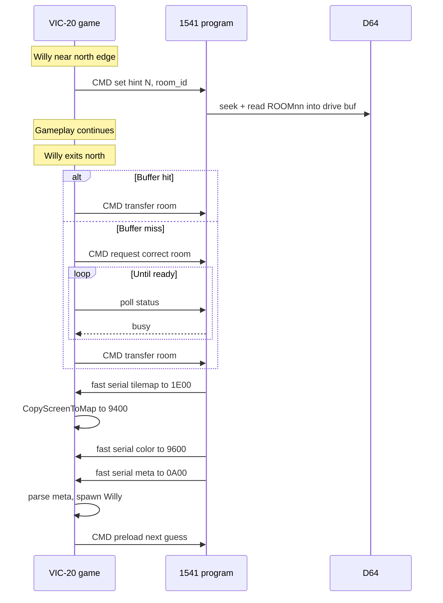

# Drive Pre-load and Fast Room Transfer (Future)

This document describes a **future optimisation** for the JSW VIC-20 port. It is **not part of the initial implementation** — phase 1 uses the KERNAL `LOAD` path documented in the main engine plan (`loader.asm`: tilemap → `$1E00`, `CopyScreenToMap` → `$9400`, color → `$9600`, metadata → `$0A00`).

---

## Goal

Upload a small **1541-resident program** to the disk drive. While Willy plays the current room, the drive:

1. **Pre-seeks and pre-reads** the most likely *next* room file into drive RAM, based on Willy’s position and the current room’s NESW connectivity bytes.
2. When a room transition occurs, uses a **fast serial transfer** to copy the pre-loaded data into VIC RAM — tilemap, color, and metadata — much faster than repeated KERNAL `LOAD` calls.

The VIC-side engine keeps the same in-memory layout (`screen_base`, `map_base`, `color_base`); only the *transport* changes.

---

## Why bother

| KERNAL loader (phase 1) | Drive pre-load + fast copy (future) |
|-------------------------|-------------------------------------|
| Full file open + read per transition | Next room often already in drive buffer |
| Serial protocol overhead each time | Tuned transfer loop, no filename parsing |
| CPU waits on disk during transition | Seek/read can overlap with gameplay |

Room transitions should feel instant or near-instant once Willy crosses an edge.

---

## Architecture

---

## VIC ↔ drive interface (sketch)

Define a minimal **command channel** over the serial bus (custom listener on device 8, or a secondary command device number). Example command bytes:

| Cmd | Meaning |
|-----|---------|
| `$01` | **Set context** — follow with current room number + Willy `px`/`py` (or edge proximity flags) |
| `$02` | **Preload** — drive picks best candidate from NESW + position, reads file into drive buffer |
| `$03` | **Transfer room** — fast-send buffered room when ready |
| `$04` | **Cancel preload** — death, title, unexpected warp |
| `$05` | **Request room** — follow with room number; drive loads that file (used on buffer miss / wrong guess) |

Response bytes: `$00` ready, `$01` busy (still reading). VIC **polls** until `$00` — **no KERNAL fallback** on transitions (KERNAL `LOAD` can take ~4 seconds, unacceptable mid-game).

Exact protocol TBD during implementation; keep it small enough to fit in ~1–2 KB on the 1541.

---

## Pre-load heuristics

Current room metadata includes **four connectivity bytes** (N, E, S, W) loaded into ZP `conn_nesw`. The VIC sends these (or the drive cached them from the last transfer) plus Willy’s position each frame or when `px`/`py` enters an **edge band** (e.g. within 1 character of north/south/east/west playfield border).

**Priority rule (simple first version):**

1. If only one direction has a non-`$FF` neighbour *and* Willy is approaching that edge → preload that room.
2. If multiple edges are open (e.g. junction), preload the room for the edge Willy is closest to / moving toward (`xadd` / recent `lastxmove` sign).
3. If Willy is centred, defer preload or keep the last buffered room until movement bias is clear.

Start preloading **early** (generous edge band) so the buffer is usually ready before Willy crosses the edge.

### Buffer miss — wait, do not KERNAL-load

If Willy transitions and the drive buffer holds the **wrong** room (or read is still in progress):

1. VIC sends **`Request room`** with the correct room number.
2. **Wait loop** — poll drive status until `$00` ready (drive busy = `$01`). Optionally animate a border colour or “loading” flash; Willy stays at the entry position (no gameplay in the new room yet).
3. When ready, **`Transfer room`** as normal.

There is **no fallback to KERNAL `LOAD`** during gameplay — a miss may pause briefly, but avoids a multi-second stall. Preload heuristics + early edge-band triggering should make misses rare.

Hard **`$FF` error** (disk fault): retry `Request room` in the same wait loop; if persistent, show error screen (still avoid KERNAL mid-game if possible).

---

## Room data on the wire

Same on-disk layout as phase 1 (see engine plan):

| Segment | Size | VIC destination |
|---------|------|-----------------|
| Tilemap | 432 | `$1E00` (`screen_base`) |
| Color | 432 | `$9600` (`color_base`) |
| Metadata tail | variable | `$0A00` |

After tilemap arrives, VIC still runs **`CopyScreenToMap`** (`$1E00` → `$9400`) — the drive does not write `$9400` directly unless the protocol is later extended to save one copy pass.

Fast loader should send segments **in this order** with length headers or fixed sizes so the VIC can set destination pointers without parsing filenames.

---

## 1541-side constraints

- **Drive RAM** is limited (~2 KB). A full room (864 bytes display + metadata + 48-byte tile UDGs + guardian blobs) may exceed one buffer — options:
  - **Buffer display only** (864 B) on drive; metadata/UDGs in a second buffer or second read pass (still via drive program, not KERNAL).
  - **Two drive buffers** if RAM allows (display vs meta/gfx).
  - **Compress** metadata (unlikely worth it for phase 2).
- Program lives in drive RAM at a fixed address (typical ML loader entry ~ `$500`–`$700` on 1541 — verify against chosen fast-loader base).
- Must coexist with DOS buffer; standard approach: install as **fast loader wedge** or standalone file `JSW1541.PRG` uploaded once per session (or stored on game disk with `OPEN`/`CMD` bootstrap from VIC).

---

## VIC-side changes (when implemented)

| Component | Change |
|-----------|--------|
| `loader.asm` | `LoadRoomFast` — transfer or `Request room` + **`WaitDriveReady`** poll loop; no KERNAL on transition |
| `gameloop.asm` | Each frame (or in edge band): `DriveHint` with position + `conn_nesw` |
| Edge transition | `LoadRoomFast`; block until drive ready, then parse + spawn |
| Title / death | `DriveCancel` — flush drive state |

Phase-1 KERNAL `LoadRoom` remains for **initial bring-up only** until the drive program replaces it entirely for production builds.

---

## Fast loader notes

- Use **serial bus routines** tuned for 1541 (`$EFn` listen/talk patterns or known open-source fast-loader sequences).
- VIC receiver loop writes directly to `$1E00` / `$9600` / `$0A00` — no tilemap staging buffer.
- Optional: transfer while disabling interrupts briefly; coordinate with raster sync if needed (avoid mid-frame tilemap tear — load during border or full-screen pause like existing `DrawMap` raster wait).
- Measure: target **well under 1 second** per room change when buffer hit; **wait time on miss** bounded by one disk read (still faster than ~4 s KERNAL `LOAD`).

---

## Disk layout suggestion

Keep phase-1 room files (`ROOM01`, etc.) unchanged. Add to game disk:

| File | Purpose |
|------|---------|
| `JSW1541` | Drive ML binary; uploaded via serial bootstrap from VIC |
| `JSWBOOT` | Optional one-shot uploader run from title screen |

Game disk directory should list rooms sequentially where possible to help **physical seek** optimisation (optional file order on `.d64` build).

---

## Testing checklist (future)

- [ ] Upload drive program from clean 1541 power-on
- [ ] Preload starts when Willy enters edge band; no gameplay stutter
- [ ] North transition uses preloaded north room (instant transfer)
- [ ] Wrong guess: `Request room` + wait loop, **no KERNAL load**; room appears when drive reports ready
- [ ] Wait state: Willy held at edge, no corrupt partial room
- [ ] Death / title cancels preload without crash
- [ ] Fast transfer + `CopyScreenToMap` + meta parse = identical room to phase-1 loader
- [ ] Works on real 1541 and x1541

---

## References in this repo

- Phase 1 loader: [`loader.asm`](../loader.asm) (to be created)
- Room format: engine plan, Phase 4
- Connectivity bytes: `conn_nesw` in room metadata (N, E, S, W)
- Memory map: `screen_base` `$1E00`, `map_base` `$9400`, `color_base` `$9600`

---

## Status

**Deferred** — implement only after the KERNAL-based room loader and 1–2 test rooms work end-to-end.
